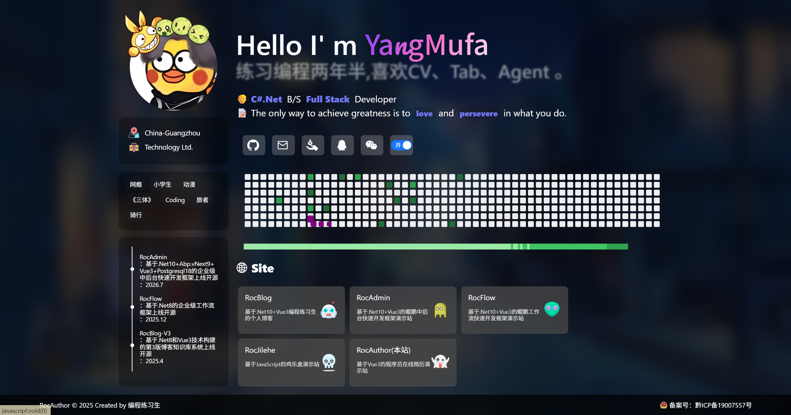

# TypeScript5 + Vite6 + Vue3 + Axios2 + AntDesignVue5 + SCSS2

This template should help get you started developing with Vue 3 and TypeScript in Vite. The template uses Vue 3 `<script setup>` SFCs, check out the [script setup docs](https://v3.vuejs.org/api/sfc-script-setup.html#sfc-script-setup) to learn more.

Learn more about the recommended Project Setup and IDE Support in the [Vue Docs TypeScript Guide](https://vuejs.org/guide/typescript/overview.html#project-setup).

  
演示站：https://author.yangmufa.cn  
GitHub：https://github.com/yangmufa/RocAuthor.git  
  
PC截图  
  
  
  
Mobile截图  
  
  
感谢 [ZYYO](https://github.com/ZYYO666)  
ZYYO前台: https://github.com/ZYYO666/homepage  
ZYYO后台：https://zyyo.cc/admin  
账号：admin  
密码：123456  
